# Lab 01 – Get Started with a Lakehouse in Microsoft Fabric

**Course:** DATA 034 · Assignment 1 &nbsp;|&nbsp; **Tools:** Microsoft Fabric Lakehouse, OneLake, Delta Lake, SQL analytics endpoint, Visual query (Power Query)

## Overview

A traditional data warehouse stores data in relational tables that you query with SQL. A data lake stores raw files without a fixed schema. A **lakehouse** combines the two: the data stays as files in the lake, and a relational schema on top lets you query it with standard SQL.

In Microsoft Fabric, a lakehouse keeps its files in **OneLake**, which is built on Azure Data Lake Storage Gen2. It uses the open-source **Delta Lake** format to define tables over those files. In this lab I built a lakehouse end to end:

1. Ingested a CSV file
2. Turned it into a Delta table
3. Analyzed it with T-SQL and with a no-code visual query

## What I built

| Item | Name |
|------|------|
| Workspace | `Kyrylo's WS` |
| Lakehouse | `KyrylosLH` |
| Source file | `Files/sales/sales.csv` (1,000 rows of sample sales orders) |
| Delta table | `dbo.sales` |

## Steps

### 1. Create a workspace and a lakehouse
I signed up for the Fabric trial and created the workspace `Kyrylo's WS`. From **New item → Store data** I then created the lakehouse `KyrylosLH`. Fabric automatically created the **Tables** and **Files** areas and a SQL analytics endpoint.

| Create workspace | New lakehouse | Lakehouse home |
|---|---|---|
| 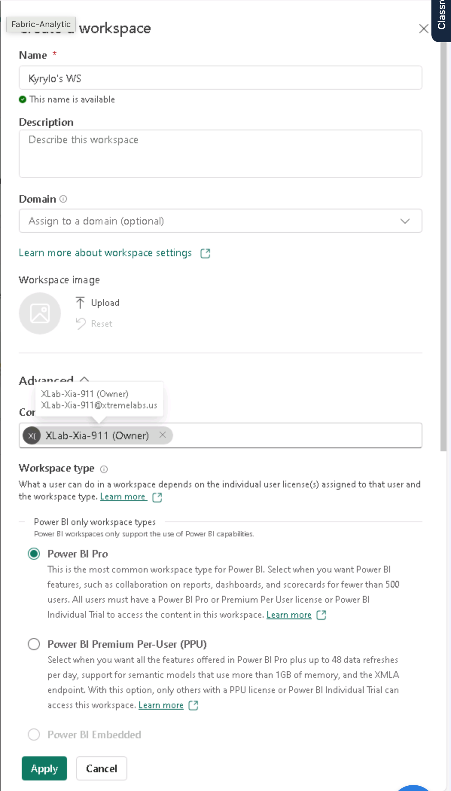 | 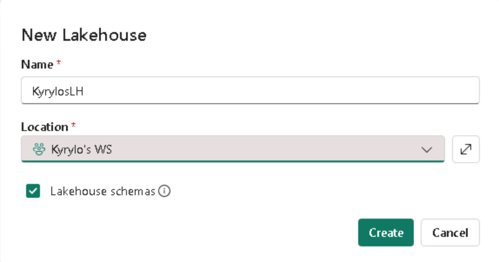 | 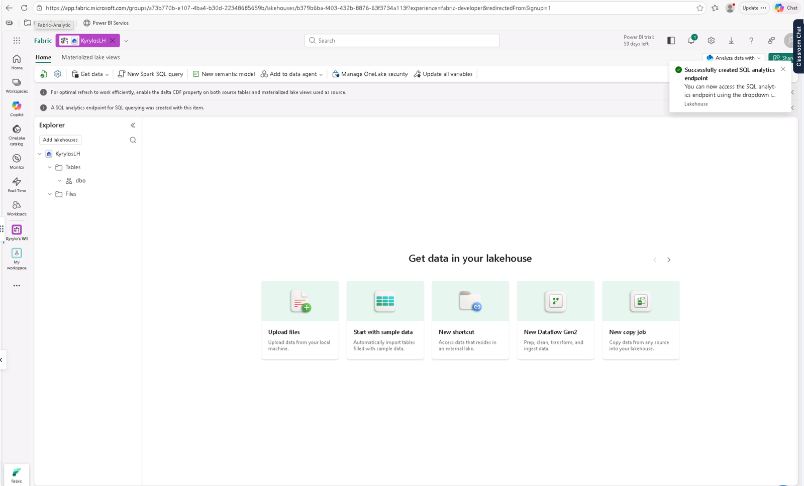 |

### 2. Upload a file and explore shortcuts
I created a `sales` subfolder under **Files** and uploaded `sales.csv` there. I also opened the **New shortcut** dialog. Shortcuts let a lakehouse reference data in OneLake, Amazon S3, ADLS Gen2, Google Cloud Storage, SharePoint and other sources without copying it.

| Uploaded file | Shortcut sources |
|---|---|
| 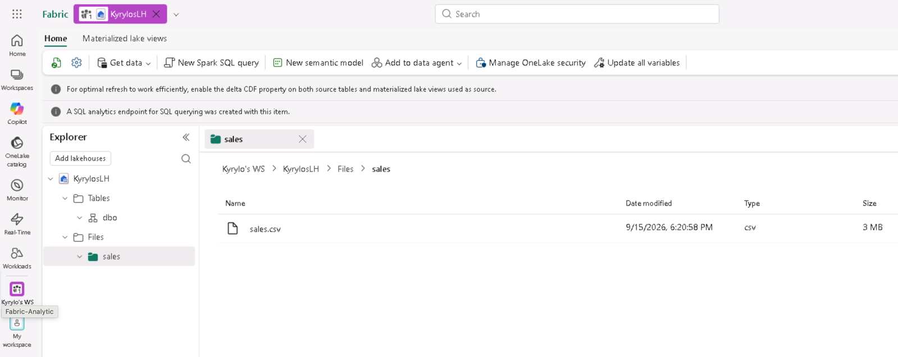 | 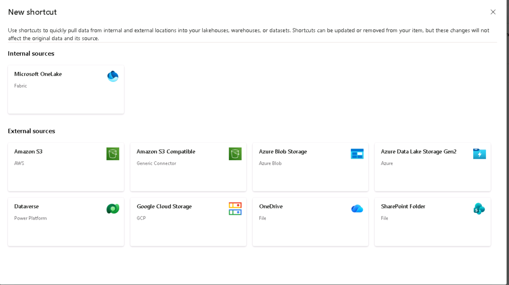 |

### 3. Load the file into a Delta table
I used **Load to Tables → New table** to turn the CSV into the managed table `dbo.sales`. In **File view** you can see how the table is stored: Parquet data files plus a `_delta_log` folder that records every transaction.

| Load to new table | Sales table (1,000 rows) | Delta/Parquet files |
|---|---|---|
| 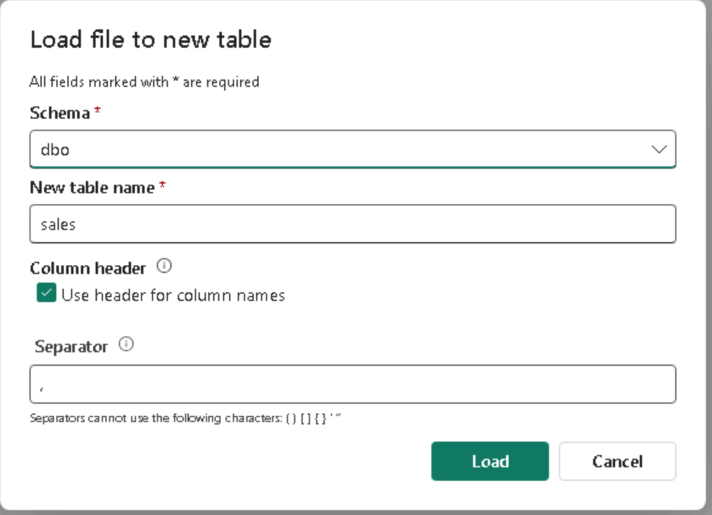 | 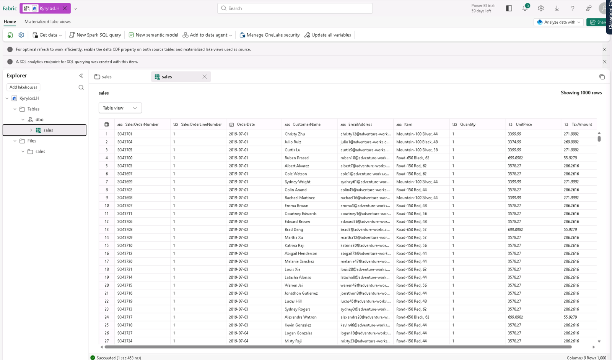 | 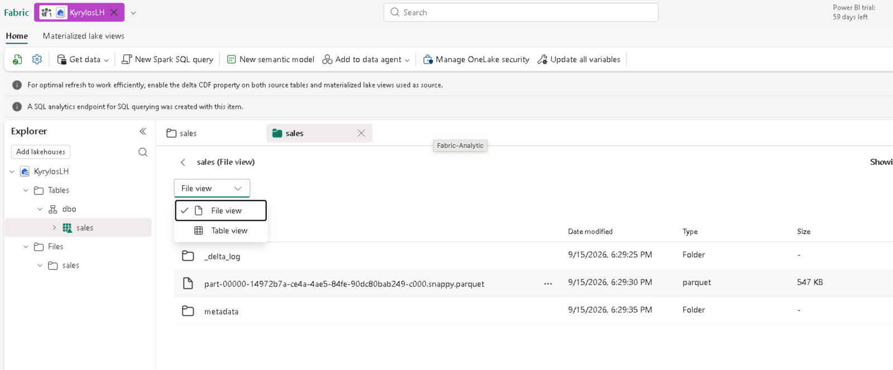 |

### 4. Query the table with SQL
I switched to the lakehouse's read-only **SQL analytics endpoint** and ran a query that calculates total revenue per item. The query is in [`scripts/revenue_by_item.sql`](scripts/revenue_by_item.sql).

```sql
SELECT Item, SUM(Quantity * UnitPrice) AS Revenue
FROM sales
GROUP BY Item
ORDER BY Revenue DESC;
```

It returned 130 items. The top seller was **Road-150 Red, 48**, with about $1.2M in revenue.

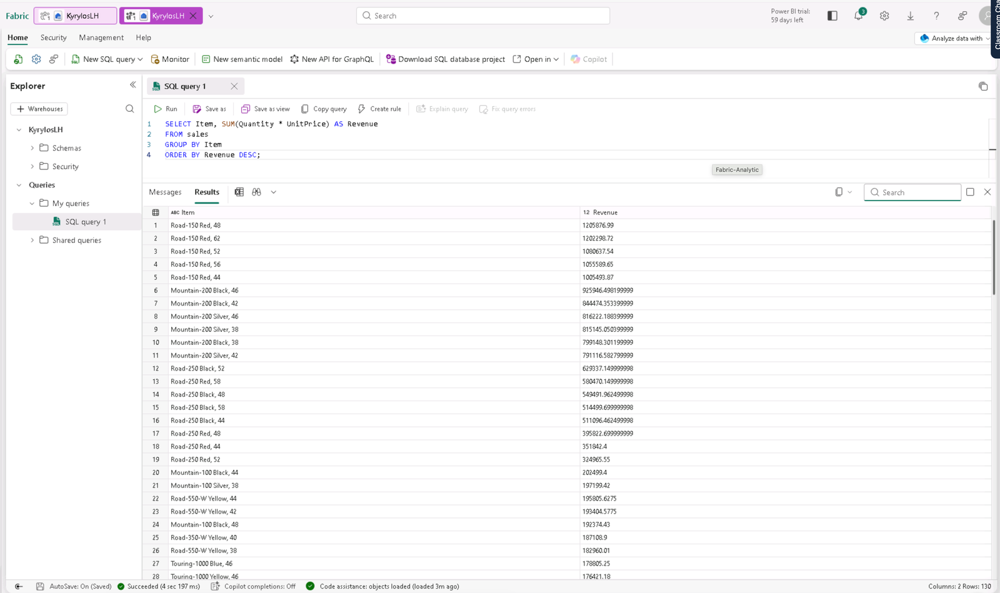

### 5. Build the same kind of analysis with a visual query
Next I ran a similar analysis without writing SQL. In the no-code **Visual query** editor I:

1. Kept only `SalesOrderNumber` and `SalesOrderLineNumber`
2. Grouped by order number
3. Counted the distinct line numbers into a new `LineItems` column

| Group by settings | Result: line items per order |
|---|---|
| 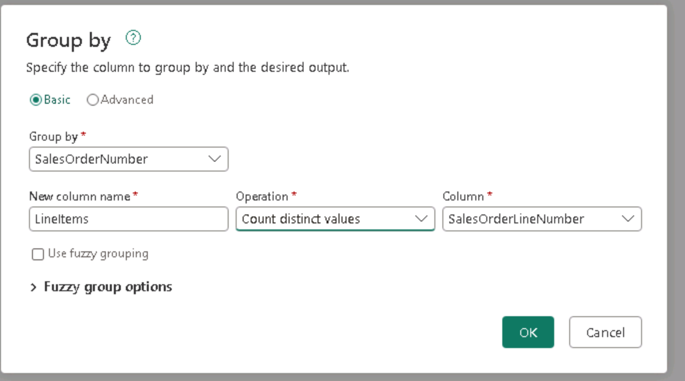 | 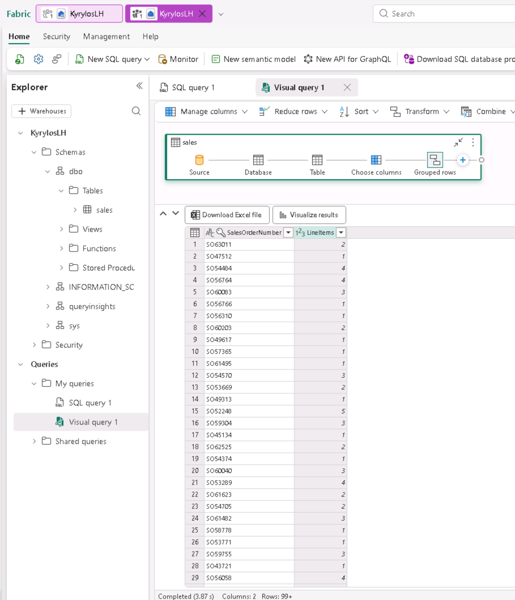 |

### 6. Clean up
Finally, I deleted the workspace from **Workspace settings → Remove this workspace** so that no trial resources were left running.

## What I learned

- A Fabric lakehouse combines data-lake flexibility (raw files in OneLake) with warehouse structure (Delta tables you can query with SQL) in one item.
- **Files** holds raw, unmanaged data. **Tables** holds managed Delta tables that have a schema.
- Loading a CSV into a table takes one step, and the result is Parquet files plus a `_delta_log` that tracks changes.
- Every lakehouse gets a read-only **SQL analytics endpoint**, so the data can be queried with T-SQL without extra setup.
- **Shortcuts** can reference external data without duplicating it.
- The same analysis can be done in SQL or in a no-code visual query, which helps analysts who prefer Power Query.
