# Lab 03 – Discover and Connect to Data in OneLake

**Course:** DATA 034 · Assignment 3 &nbsp;|&nbsp; **Tools:** OneLake catalog, OneLake shortcuts, SQL analytics endpoint, Semantic model, Explore this data

## Overview

In real organizations, data is spread across teams. Data engineers build lakehouses, other teams build warehouses, and analysts build semantic models. As an analytics engineer, you first need to **find** that data and **connect** to it, ideally without making copies.

In this lab I did four things:

- Played the data engineer and published a sales lakehouse
- Found that lakehouse through the **OneLake catalog**
- Connected to it from a second lakehouse with a **shortcut**
- Analyzed it with SQL and a semantic model

## What I built

| Item | Name | Role |
|------|------|------|
| Workspace | `Kyrylo's WS` | |
| Lakehouse | `lakehouse001` | Source: the data engineering team's lakehouse with the `sales` table |
| Lakehouse | `lakehouse002` | Analytics: holds a **shortcut** to `lakehouse001.sales` |
| Semantic model | `Sales Analysis` | Direct Lake model over the shortcut table |

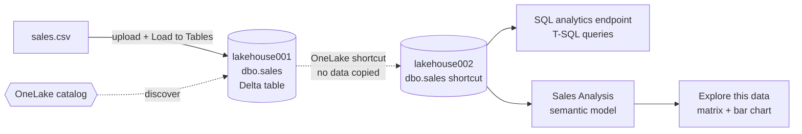

## Steps

### 1. Set up the source lakehouse
I created the workspace and the lakehouse `lakehouse001`, uploaded `sales.csv` and loaded it into a Delta table named `sales`. **File view** shows the Parquet data files and the `_delta_log` folder. The log is what enables ACID transactions and time travel.

| Create workspace | Uploaded file | Load to new table |
|---|---|---|
| 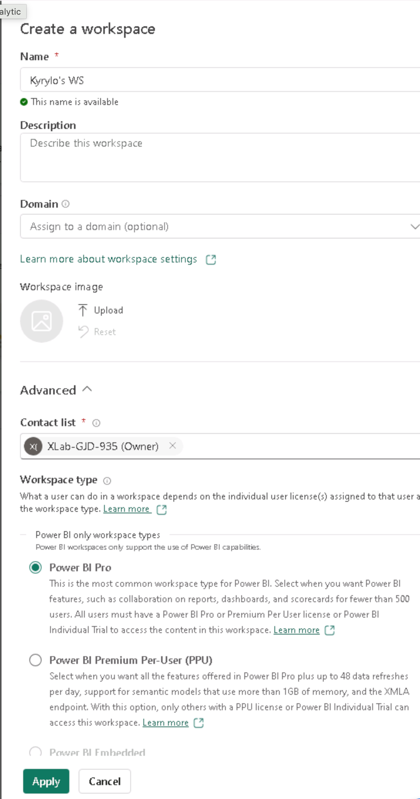 | 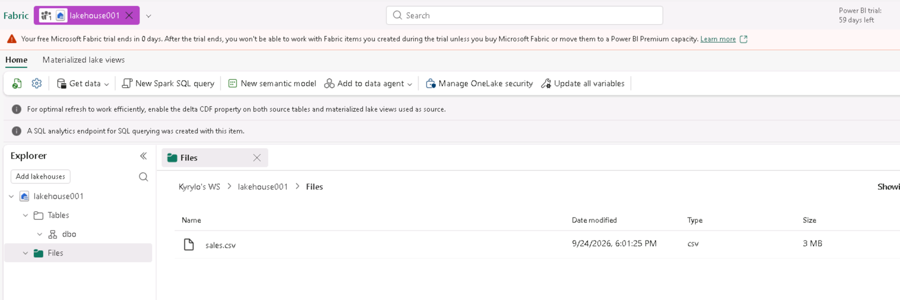 | 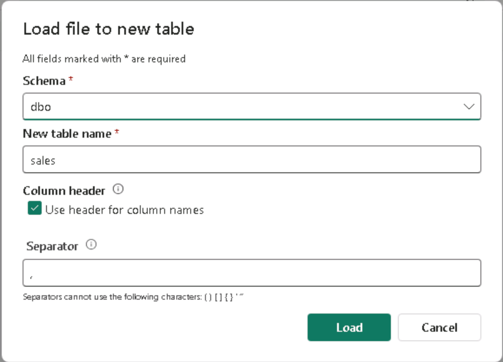 |

| Sales table | Delta files |
|---|---|
| 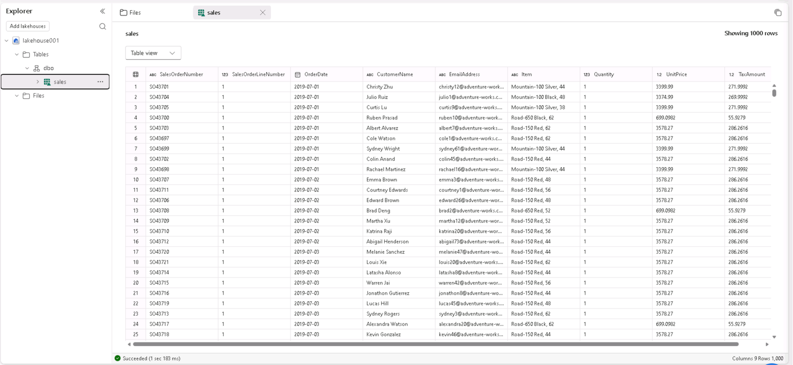 | 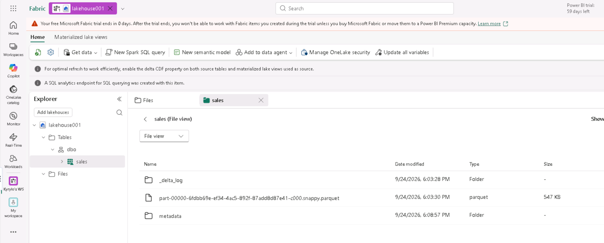 |

### 2. Discover the data in the OneLake catalog
The **OneLake catalog** gives one view of every data item you have permission to see across the tenant. In it I found `lakehouse001` along with other semantic models. The item details show the location, last update time, owner and SQL connection string.

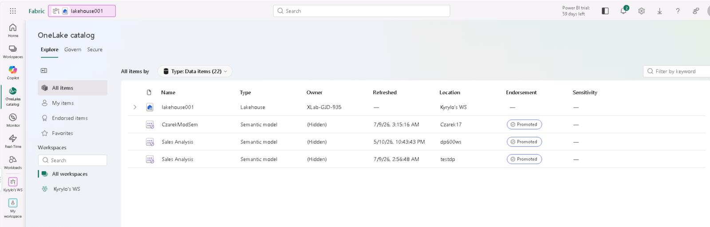

### 3. Connect with a shortcut instead of a copy
I created a second lakehouse, `lakehouse002`, to act as the analytics side. Under its **Tables** folder I added a **New table shortcut** with these settings:

- Source: **Microsoft OneLake**
- Target: `lakehouse001 → Tables → dbo → sales`

The shortcut appears as a `sales` table in `lakehouse002`. It shows the same 1,000 rows as a live reference, and **no data was copied**.

| New table shortcut | Choose the source table | Shortcut summary | Shortcut data |
|---|---|---|---|
| 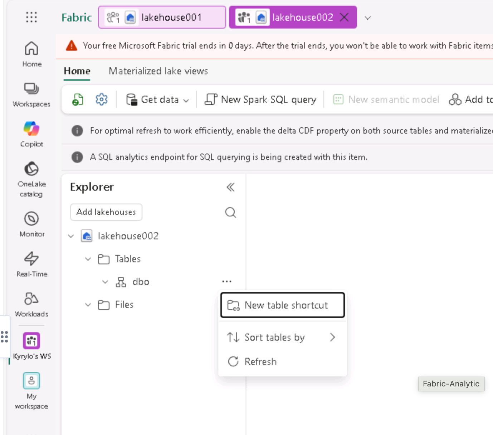 | 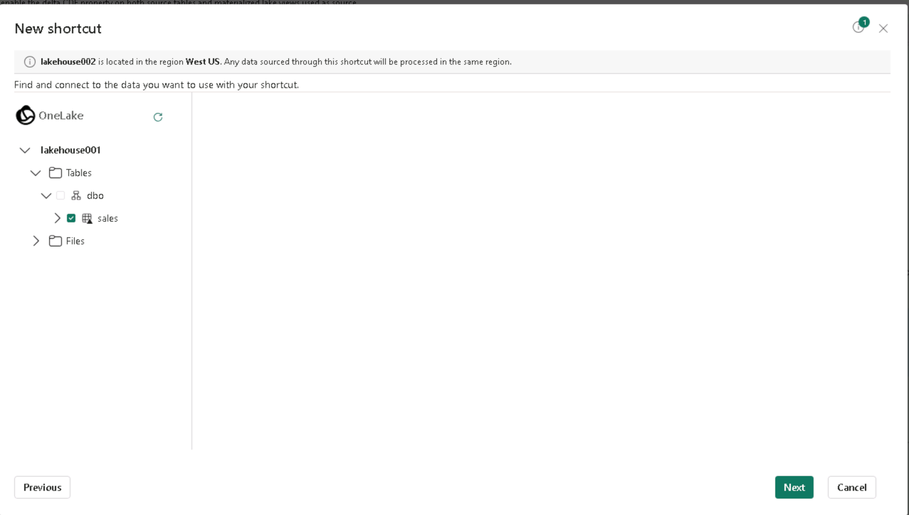 | 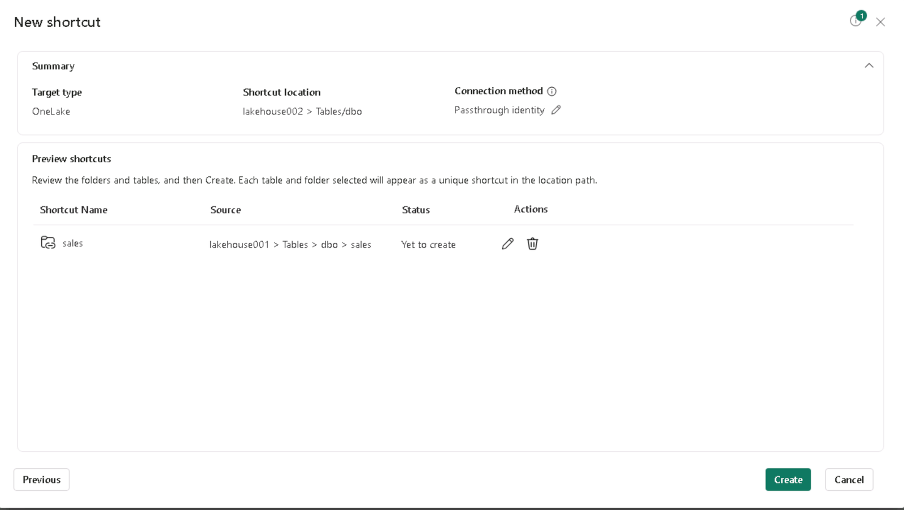 | 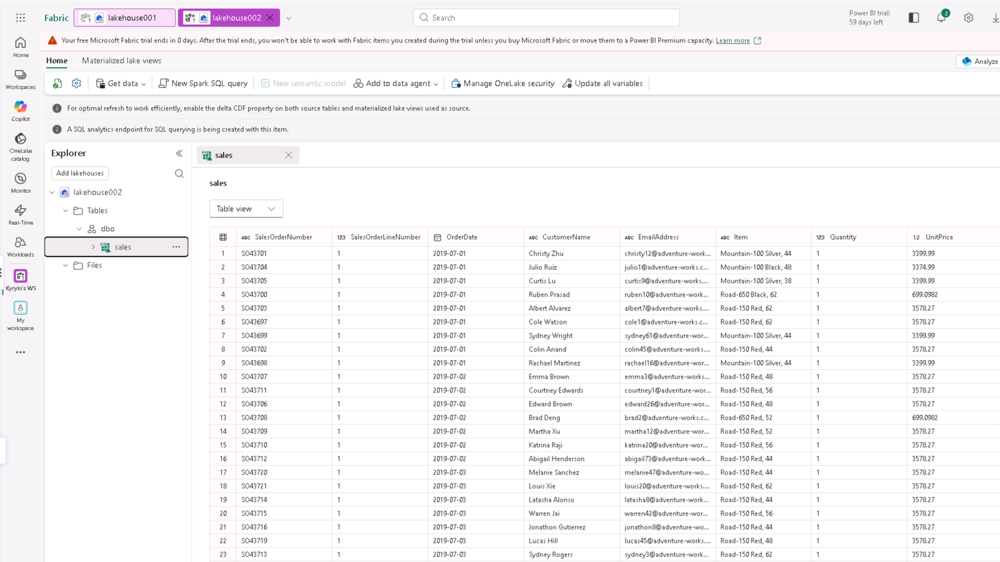 |

### 4. Query through the SQL analytics endpoint
I queried the shortcut table from `lakehouse002`'s SQL analytics endpoint. The queries are in [`scripts/sales_analysis.sql`](scripts/sales_analysis.sql).

- **Revenue and quantity by item.** Road-150 Red, 48 led with about $1.2M in revenue.
- **Top 5 customers by revenue.** Larry Vazquez, Kaitlyn Henderson, Nichole Nara, Kate Anand and Margaret He each had about $10.8K.

| Revenue by item | Top 5 customers |
|---|---|
| 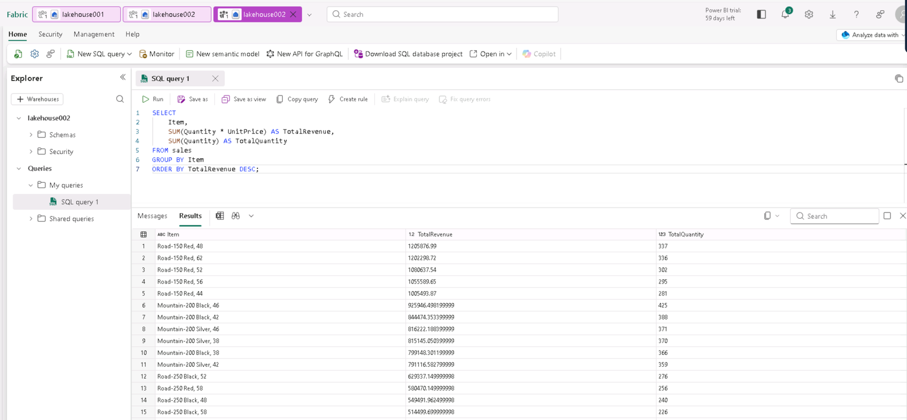 | 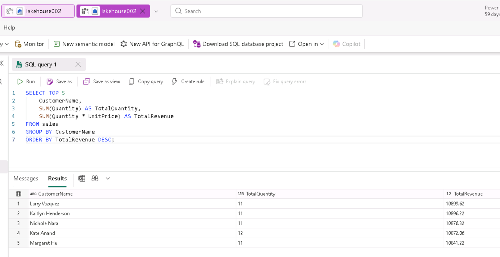 |

### 5. Create and explore a semantic model
From the SQL endpoint I created the **Sales Analysis** semantic model (Direct Lake on SQL) over the `sales` table. I then opened it with **Explore this data** and built a matrix and a bar chart of **quantity sold by item**. **Water Bottle – 30 oz.** was the top item with 2,097 units, and the total was 32,718 units, all without opening Power BI Desktop.

| New semantic model | Workspace items | Explore: quantity by item |
|---|---|---|
| 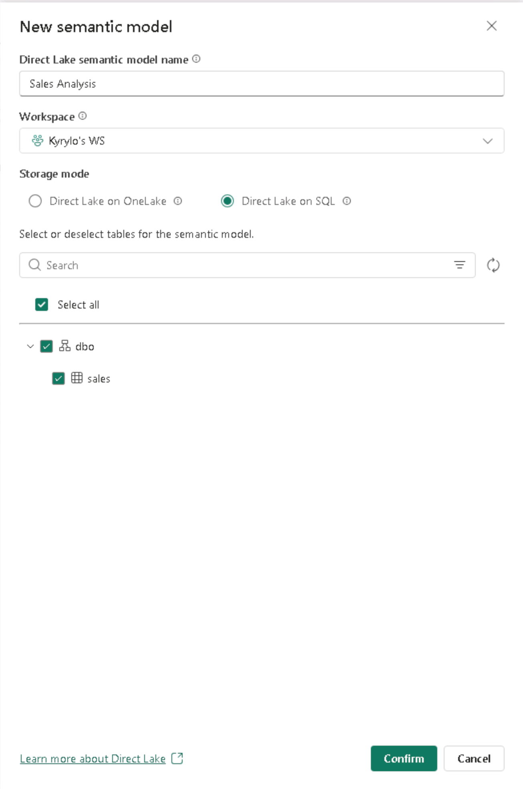 | 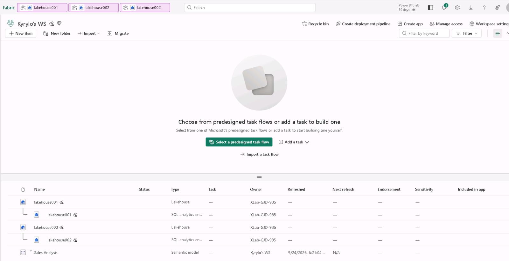 | 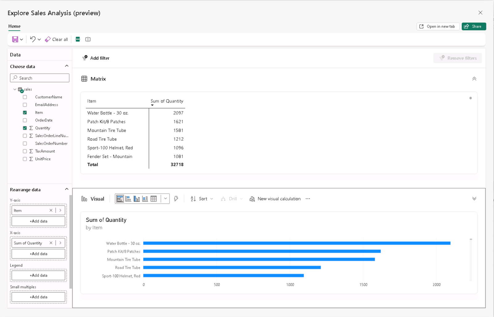 |

### 6. Clean up
Finally, I removed the workspace from **Workspace settings**.

## What I learned

- The **OneLake catalog** is where you start discovering data. It respects permissions and shows metadata such as owner, location, refresh time and connection string.
- **Shortcuts** let a team use another team's data in place. This avoids duplicate storage and stale copies, and the data always reflects the source.
- A shortcut table behaves like a local table. It can be queried through the SQL analytics endpoint and used in semantic models.
- **Direct Lake** semantic models plus **Explore this data** allow quick ad-hoc visual analysis directly in the Fabric portal.
