# Lab 04 – Design and Implement a Dimensional Model

**Course:** DATA 034 · Lab 4 &nbsp;|&nbsp; **Tools:** Microsoft Fabric Warehouse, T-SQL, table constraints, slowly changing dimensions

## Overview

In this lab I designed and implemented a **star schema** for *Contoso Retail*, a fictional retailer that needs to analyze sales by store, product, customer and time period. I built the whole model in a Fabric Warehouse with T-SQL. I:

1. Created one fact table and four dimension tables
2. Added primary and foreign key constraints
3. Loaded sample data
4. Queried the model from different angles
5. Implemented **SCD Type 1** and **SCD Type 2** changes

## What I built

| Item | Name |
|------|------|
| Workspace | `Kyrylo's WS` |
| Warehouse | `ContosoDW` |
| Fact table | `f_Sales` (grain: one row per sales transaction line item) |
| Dimension tables | `d_Date`, `d_Store`, `d_Product`, `d_Customer` |

### Data model

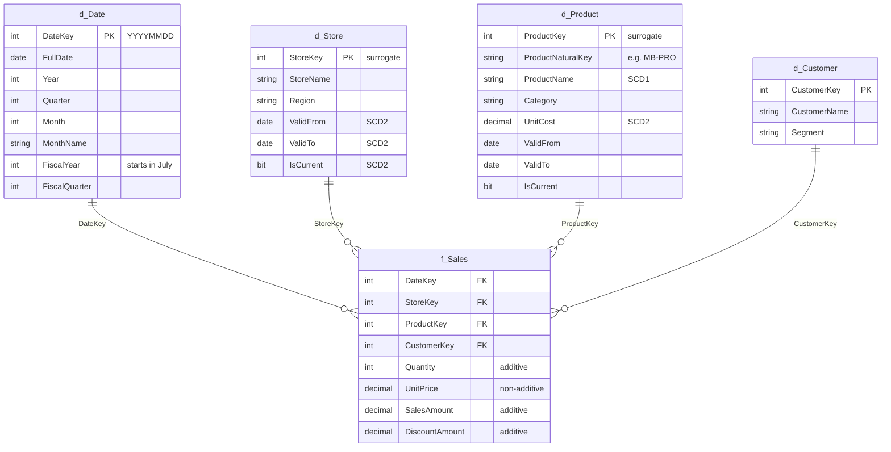
```mermaid
erDiagram
    d_Date     ||--o{ f_Sales : DateKey
    d_Store    ||--o{ f_Sales : StoreKey
    d_Product  ||--o{ f_Sales : ProductKey
    d_Customer ||--o{ f_Sales : CustomerKey

    f_Sales {
        int DateKey FK
        int StoreKey FK
        int ProductKey FK
        int CustomerKey FK
        int Quantity "additive"
        decimal UnitPrice "non-additive"
        decimal SalesAmount "additive"
        decimal DiscountAmount "additive"
    }
    d_Date {
        int DateKey PK "YYYYMMDD"
        date FullDate
        int Year
        int Quarter
        int Month
        string MonthName
        int FiscalYear "starts in July"
        int FiscalQuarter
    }
    d_Store {
        int StoreKey PK "surrogate"
        string StoreName
        string Region
        date ValidFrom "SCD2"
        date ValidTo "SCD2"
        bit IsCurrent "SCD2"
    }
    d_Product {
        int ProductKey PK "surrogate"
        string ProductNaturalKey "e.g. MB-PRO"
        string ProductName "SCD1"
        string Category
        decimal UnitCost "SCD2"
        date ValidFrom
        date ValidTo
        bit IsCurrent
    }
    d_Customer {
        int CustomerKey PK
        string CustomerName
        string Segment
    }
```

## Steps

### 1. Create the warehouse
I created the workspace `Kyrylo's WS` and the warehouse `ContosoDW` in it.

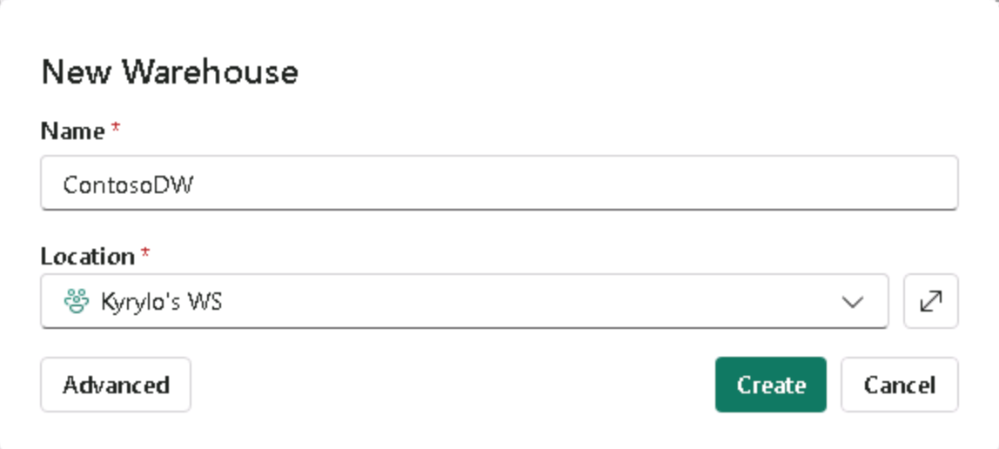

### 2. Create the fact table
The fact table stores the business events to measure, which here are sales transactions. It has four foreign keys and four measures. It has **no primary key on purpose**, because a key would add storage without helping analysis. The code is in [`scripts/01_create_tables.sql`](scripts/01_create_tables.sql).

| CREATE TABLE f_Sales | Empty table: 8 columns, 0 rows |
|---|---|
| 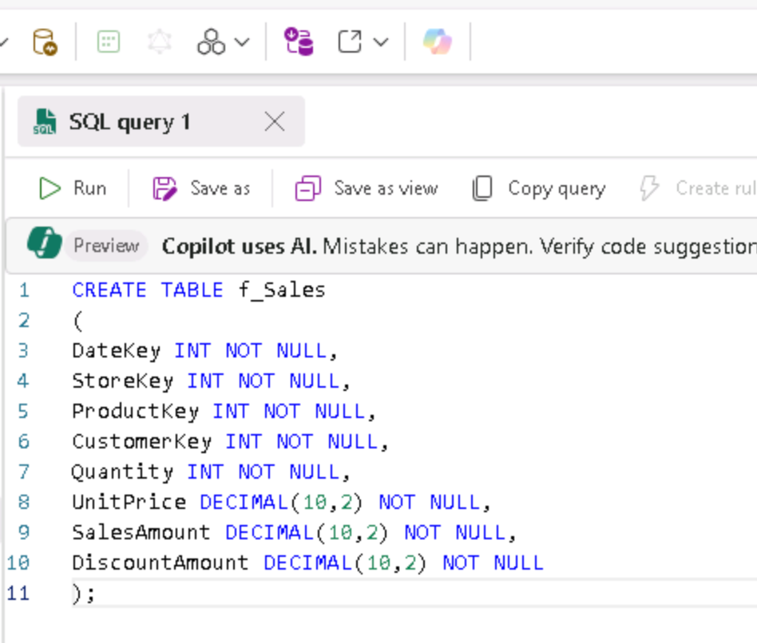 | 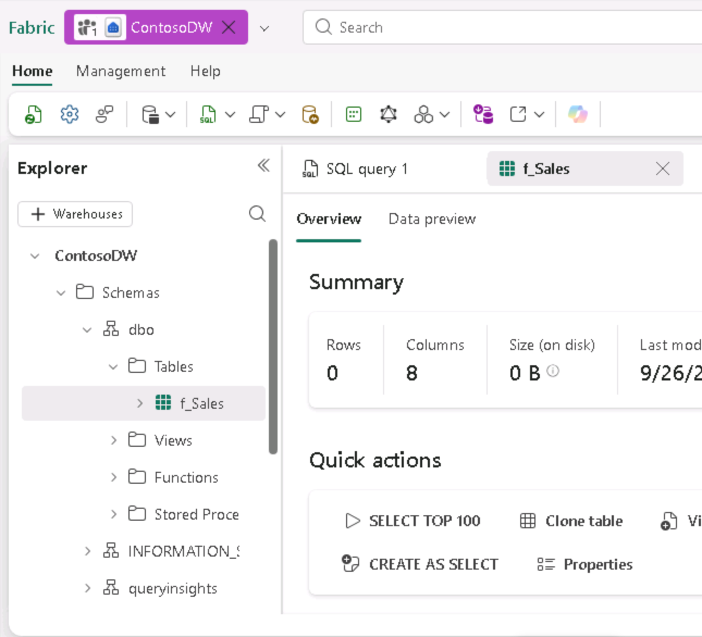 |

### 3. Create the dimension tables
The dimensions give the facts their context: who bought, what, when and where.

- **`d_Date`** uses a `YYYYMMDD` integer key and has both calendar and fiscal columns. The fiscal year starts in July.
- **`d_Store`** and **`d_Product`** each have a **natural key** from the source system, a **surrogate key** that identifies each version of the row, and SCD Type 2 tracking columns: `ValidFrom`, `ValidTo` and `IsCurrent`.
- **`d_Customer`** is simpler, because customers only need Type 1 corrections.

| Dimension DDL | All five tables |
|---|---|
| 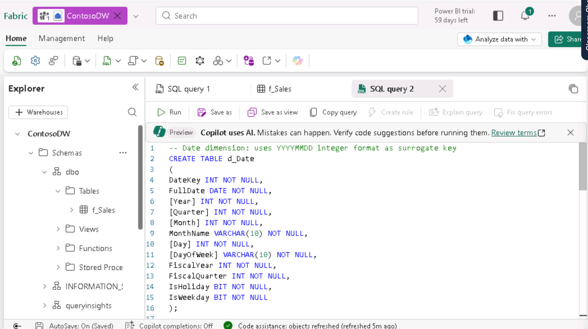 | 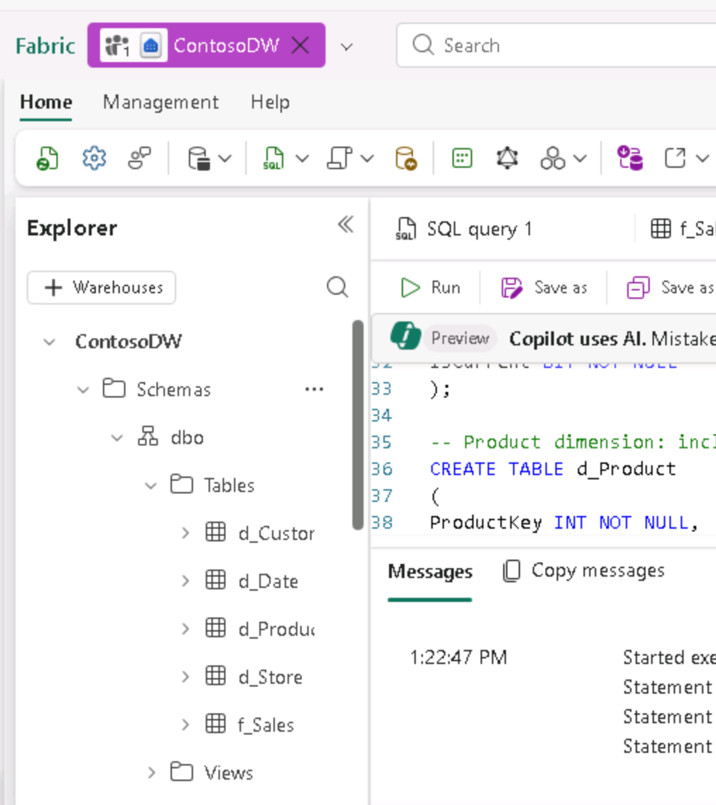 |

### 4. Add table constraints
Fabric Warehouse doesn't allow keys inside `CREATE TABLE`, so I added them with `ALTER TABLE`. Each dimension got a primary key, and `f_Sales` got four foreign keys. All of them are **`NOT ENFORCED`**. They act as metadata that documents the relationships and helps Power BI detect them automatically. The code is in [`scripts/02_add_constraints.sql`](scripts/02_add_constraints.sql).

```sql
ALTER TABLE d_Date
    ADD CONSTRAINT PK_d_Date PRIMARY KEY NONCLUSTERED (DateKey) NOT ENFORCED;

ALTER TABLE f_Sales
    ADD CONSTRAINT FK_Sales_Date FOREIGN KEY (DateKey)
    REFERENCES d_Date(DateKey) NOT ENFORCED;
```

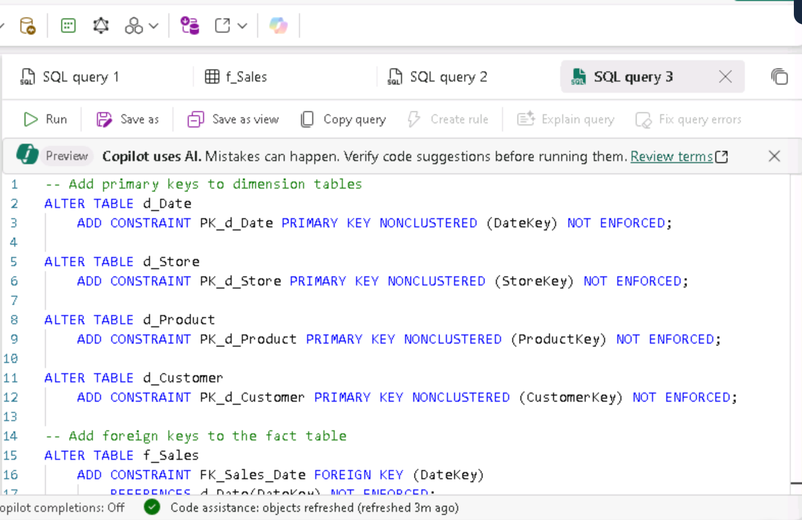

### 5. Load sample data
I loaded 6 dates, 4 stores, 5 products, 5 customers and 10 sales transactions.

| INSERT script | Fact table: 10 rows |
|---|---|
| 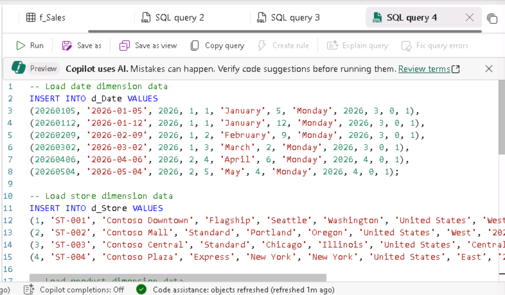 | 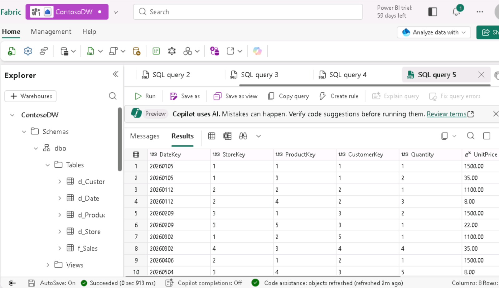 |

### 6. Query the star schema
The queries are in [`scripts/03_analytical_queries.sql`](scripts/03_analytical_queries.sql).

- **By month and category.** February Bikes led with $3,000.00, and Bikes out-earned Accessories every month. Grouping by `d.[Month]` as well as `MonthName` keeps the months in calendar order instead of alphabetical order.
- **By region and customer segment.** West / Standard led with $3,724.00 from 4 transactions, followed by Central / Premium with $3,062.00 from 3.

To answer a different business question, I only changed which dimensions appear in the `JOIN` and `GROUP BY`. The schema itself stayed the same, which is the main advantage of a star schema.

| Month × Category results | Region × Segment query | Region × Segment results |
|---|---|---|
| 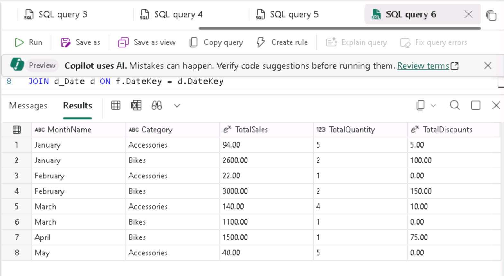 | 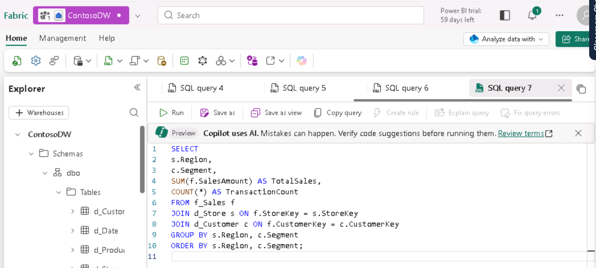 | 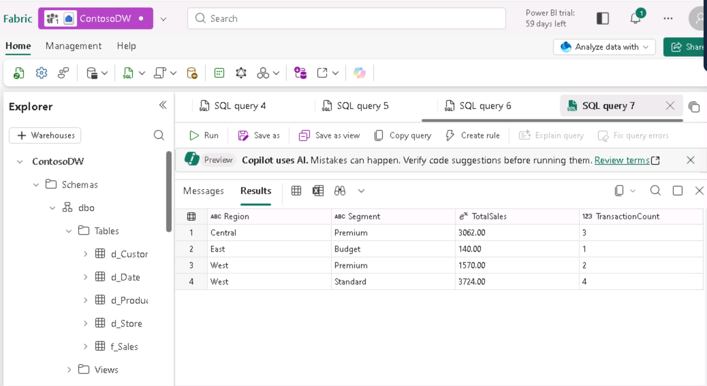 |

### 7. Implement SCD patterns
`d_Product` uses both patterns. The code is in [`scripts/04_scd_patterns.sql`](scripts/04_scd_patterns.sql).

**SCD Type 2, for `UnitCost`.** The business needs cost history for margin analysis. On March 1, 2026, the Mountain Bike Pro's cost rose from $1,200 to $1,350. I:

1. Expired the current row (`ValidTo = '2026-03-01'`, `IsCurrent = 0`)
2. Inserted a new version with the new surrogate key **6**
3. Added a May sale that references the new version

The January, February and April sales still point to the $1,200 version. Only the May sale uses $1,350. Because the selling price stayed at $1,500, the margin per bike fell from **$300 to $150**. Without Type 2, every past sale would show the new cost and the historical margins would be wrong.

| SCD Type 2 script | Each sale keeps its cost version |
|---|---|
| 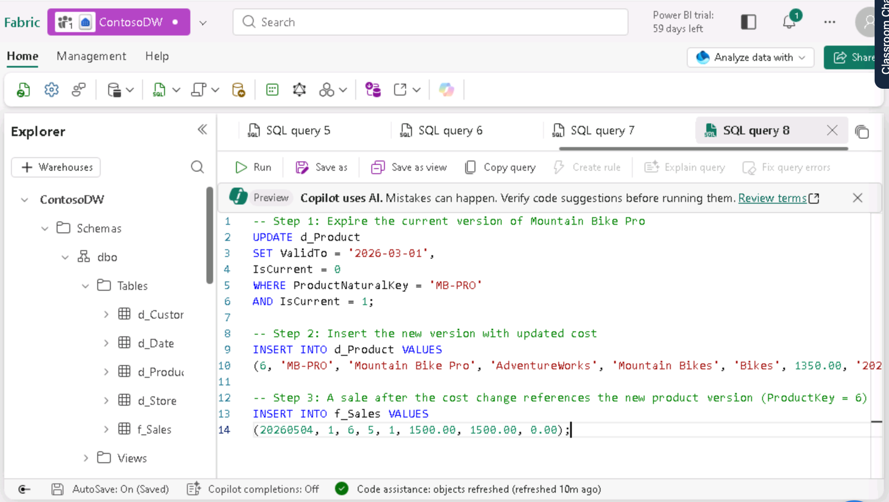 | 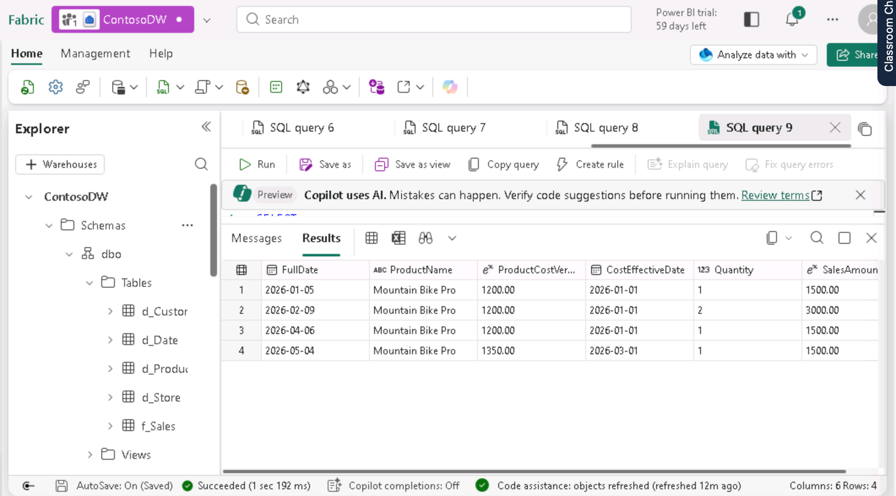 |

**SCD Type 1, for `ProductName`.** This was a name correction, so it should apply to all history. I overwrote "Water Bottle" with "Insulated Water Bottle" in place.

| SCD Type 1 update | d_Product after both changes |
|---|---|
| 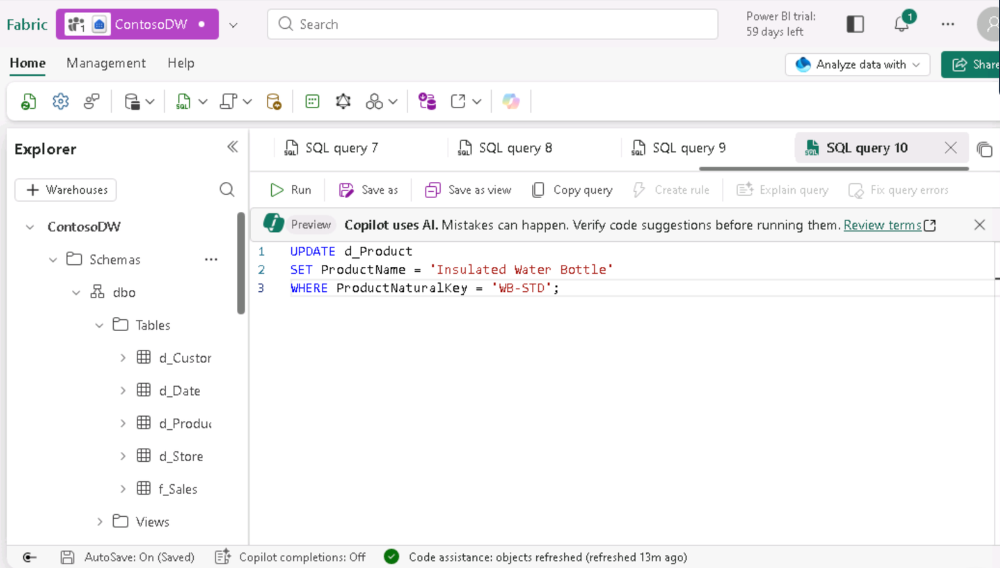 | 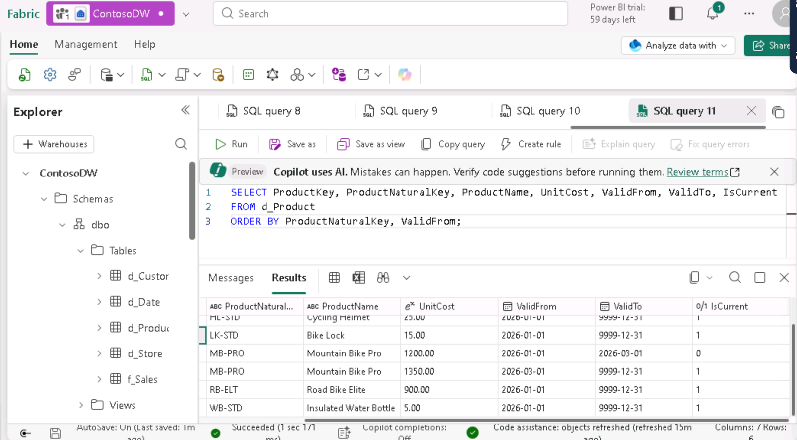 |

After both changes, `MB-PRO` has **two rows**: key 1 at $1,200 with `IsCurrent = 0`, and key 6 at $1,350 with `IsCurrent = 1`. `WB-STD` still has **one row**, and the old name is gone.

### 8. Verify the design
Finally, I ran a query joining all four dimensions to the fact table. It returned 13 columns and 11 rows: the 10 original sales plus the May sale.

The results confirm the model supports analysis:

- by time: Year > Quarter > Month > Day
- by location: Region > Country > State > City
- by product: Category > Subcategory > Brand > Product
- by customer segment and loyalty tier

They also confirm the Type 1 change applies to all history. The January sale already shows "Insulated Water Bottle".

| Full model query | Results |
|---|---|
| 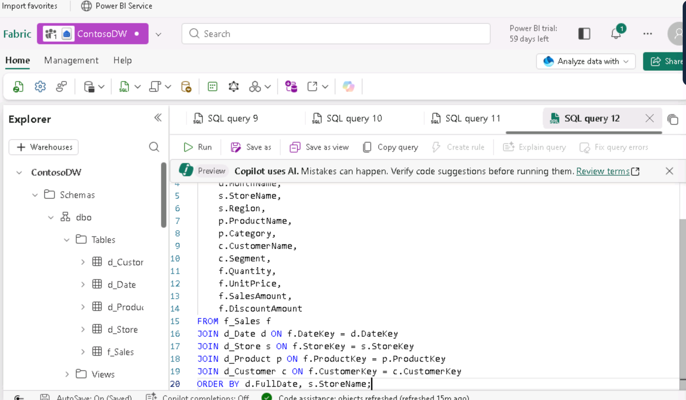 | 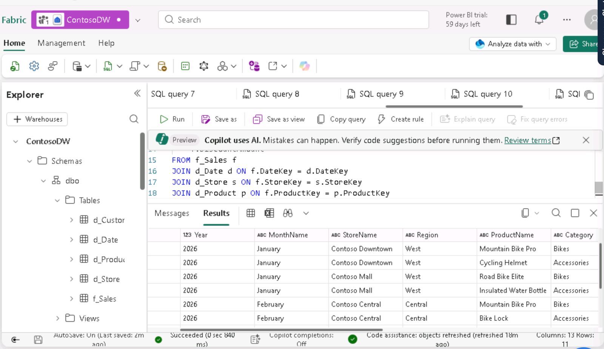 |

### 9. Clean up
At the end I removed the workspace from **Workspace settings → General → Remove this workspace**.

## Reflection

This lab showed me how a star schema is **designed**, not only how it's queried. The first design decision is the **grain** of the fact table, which here is one row per sales line item. Measures come in two kinds:

- **Additive** measures, like `Quantity` and `SalesAmount`, can be summed across every dimension.
- **Non-additive** measures, like `UnitPrice`, should be averaged or used inside calculations instead.

At first, **`NOT ENFORCED`** keys seemed strange. They make sense as metadata: they document the relationships and feed Power BI's relationship detection. The trade-off is that the warehouse won't reject bad data, so the loading process has to keep the keys correct. The `YYYYMMDD` date key is easy to read and efficient to join on.

The most useful part was **slowly changing dimensions**. Choosing between Type 1 and Type 2 is a business decision:

- **Type 2** is needed when history matters for analysis, as in the margin example.
- **Type 1** is enough for corrections.

This lab showed me how design decisions in the warehouse directly affect the reports built on top of it.
