# Lab 05 – Create DAX Calculations in Semantic Models

**Course:** DATA 034 · Lab 5 &nbsp;|&nbsp; **Tools:** Power BI Desktop, DAX (calculated tables, calculated columns, measures), model relationships, hierarchies

## Overview

In this lab I worked in **Power BI Desktop** with an Adventure Works sales semantic model and extended it with **Data Analysis Expressions (DAX)**. The goal was to put business logic directly into the model, so report authors get ready-made tables, columns and measures instead of building calculations themselves. I:

1. Created two **calculated tables**: `Salesperson` and `Date`
2. Added fiscal **calculated columns** and a `Fiscal` hierarchy, and marked `Date` as the date table
3. Created **simple measures** for pricing and counts, organized in display folders
4. Created **advanced measures** that compare each salesperson's sales to their target

All the DAX I wrote is in [`scripts/dax_calculations.dax`](scripts/dax_calculations.dax).

## What I built

| Type | Name | Purpose |
|------|------|---------|
| Calculated table | `Salesperson` | Analyze the sales each salesperson made |
| Calculated table | `Date` | Calendar covering full fiscal years (FY ends in June) |
| Calculated columns | `Year`, `Quarter`, `Month`, `MonthKey` | Fiscal periods, plus a hidden sort key |
| Hierarchy | `Fiscal` | Year > Quarter > Month |
| Measures (Pricing folder) | `Avg Price`, `Median Price`, `Min Price`, `Max Price` | Fixed aggregation of unit price |
| Measures (Counts folder) | `Orders`, `Order Lines` | Order and line counts |
| Measures (Targets table) | `Target`, `Variance`, `Variance Margin` | Performance against target |

## Steps

### 1. Explore the starter model
I opened the `14-Starter-Sales Analysis.pbix` file from Microsoft's lab files. Page 1 already had a table visual with **Sales** and **Target** for each salesperson.

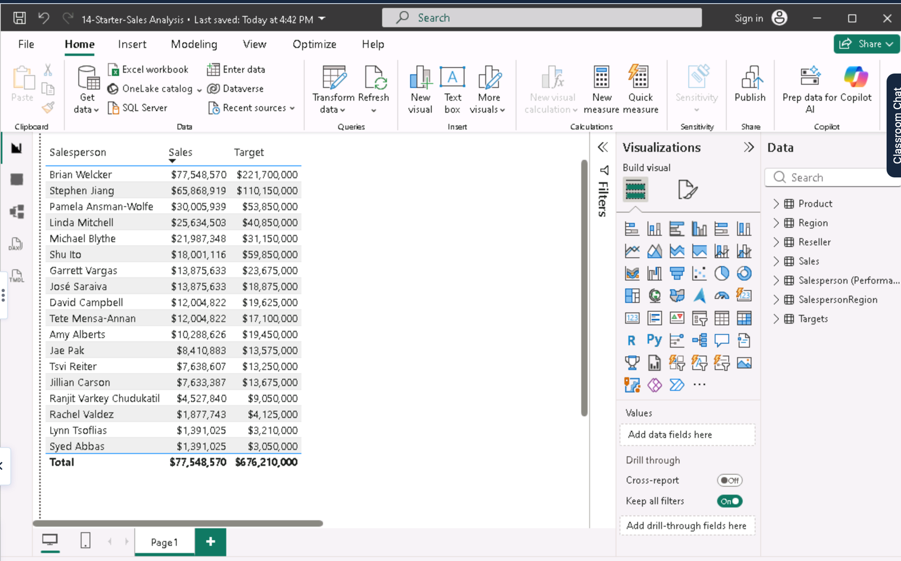

### 2. Create the Salesperson calculated table
I created a copy of the `Salesperson (Performance)` table. The copy includes only the data; properties such as hidden columns and formatting aren't copied.

```dax
Salesperson = 'Salesperson (Performance)'
```

The relationship between `Sales` and `Salesperson (Performance)` was inactive. I created a new **active one-to-many** relationship from `Salesperson[EmployeeKey]` to `Sales[EmployeeKey]` and deleted the old inactive one. I then hid the `EmployeeID`, `EmployeeKey` and `UPN` columns.

Finally, I added a description to each table, which shows as a tooltip in the Data pane:

- **Salesperson:** "Salesperson related to Sales". It analyzes the sales each person made.
- **Salesperson (Performance):** "Salesperson related to region(s)". It analyzes sales in the regions assigned to each person.

| Calculated table | New relationship | Table description |
|---|---|---|
| 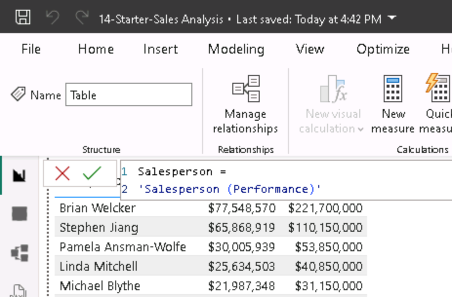 | 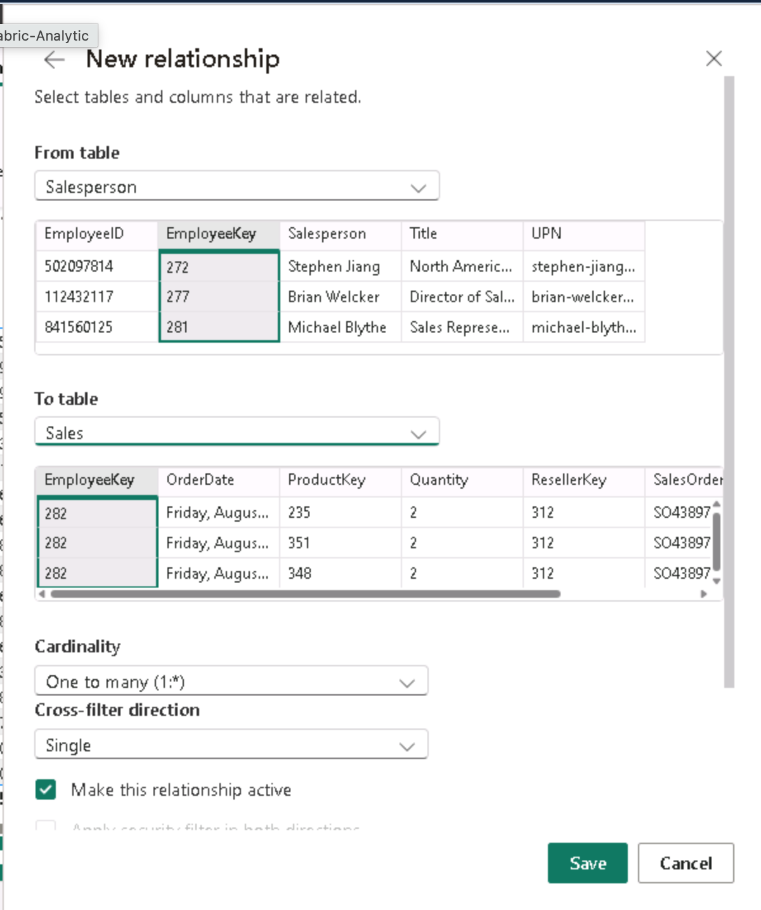 | 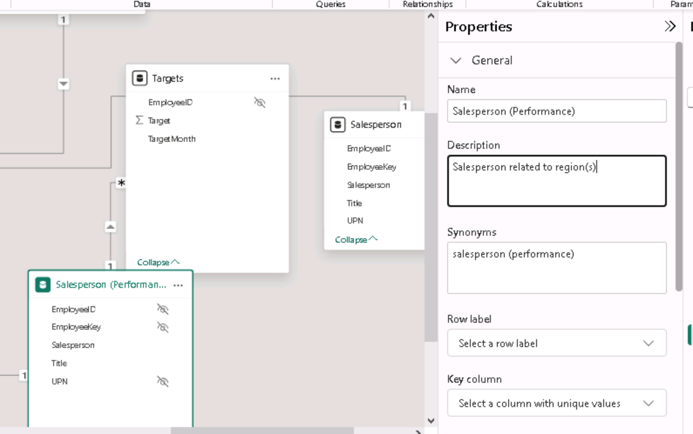 |

### 3. Create the Date table
```dax
Date = CALENDARAUTO(6)
```
`CALENDARAUTO` scans every date column in the model and returns one row per day. The argument `6` means the fiscal year ends in June, so the table covers full fiscal years. It starts on 7/1/2017 and has **1,826 rows**, which is five full fiscal years.

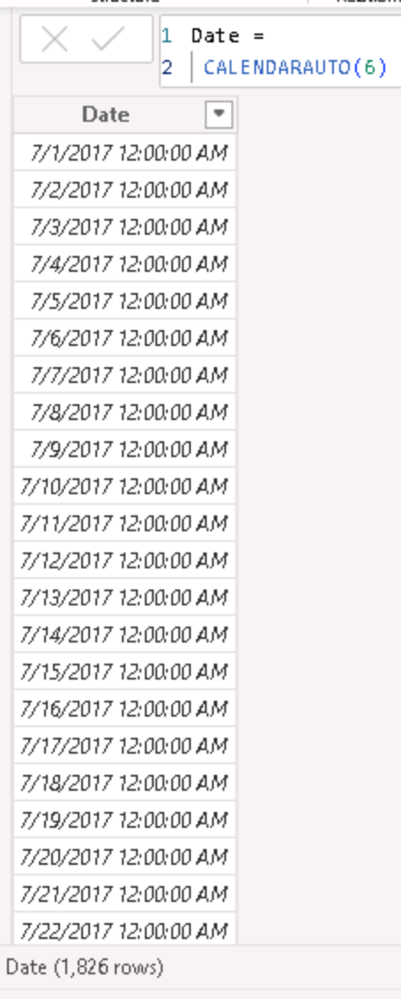

### 4. Add fiscal calculated columns
Adventure Works' fiscal year starts in July, so July 1, 2017 belongs to **FY2018**, and July–September is **Q1**.

```dax
Year  = "FY" & YEAR('Date'[Date]) + IF(MONTH('Date'[Date]) > 6, 1)
Month = FORMAT('Date'[Date], "yyyy MMM")
```

| Year column | Quarter and Month columns |
|---|---|
| 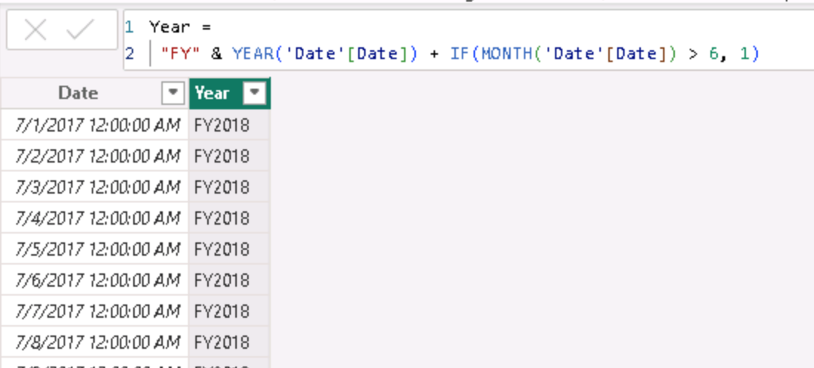 | 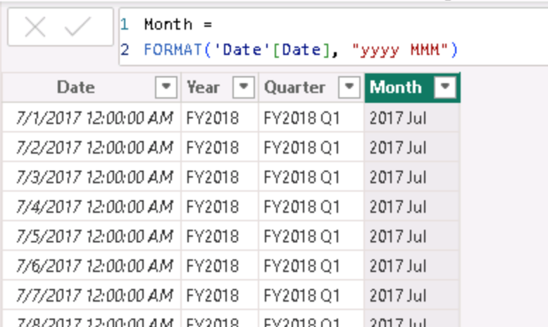 |

When I tested the columns in a matrix, the months were sorted **alphabetically** (2017 Aug, 2017 Dec, 2017 Jul…), because `Month` is a text column. To fix this, I added a numeric sort key and set **Month → Sort by column → MonthKey**:

```dax
MonthKey = (YEAR('Date'[Date]) * 100) + MONTH('Date'[Date])   -- e.g. 201707
```

| Before: alphabetical | MonthKey column | After: chronological |
|---|---|---|
| 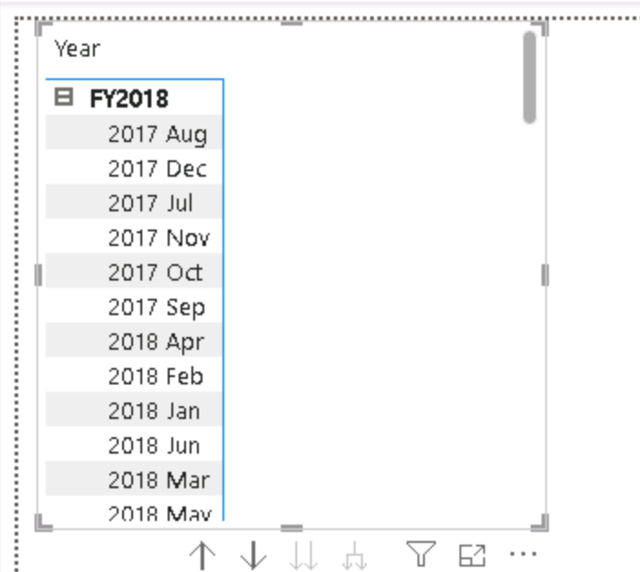 | 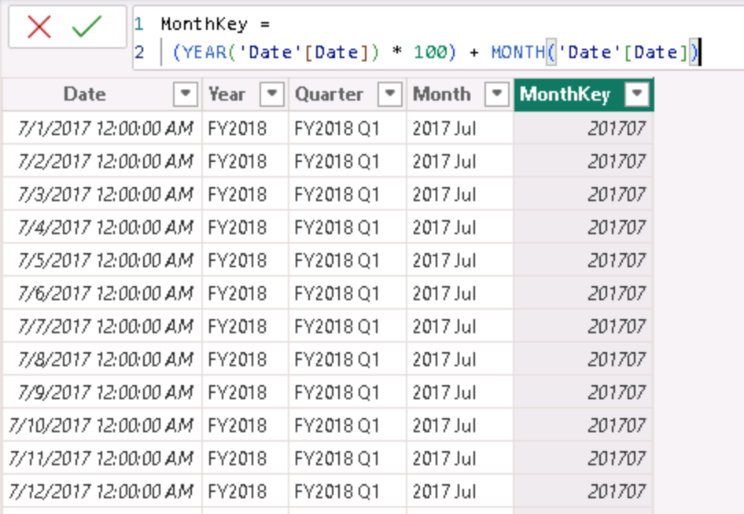 | 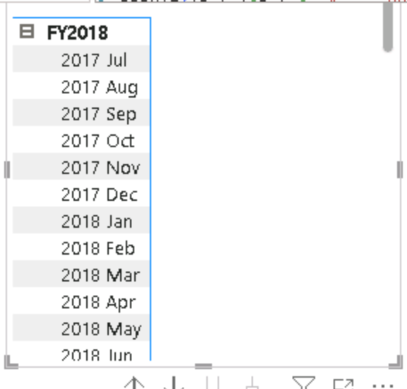 |

### 5. Complete and mark the Date table
To finish the Date table, I:

1. Hid `MonthKey`, which is only needed for sorting
2. Built the **Fiscal** hierarchy: Year > Quarter > Month
3. Related `Date[Date]` to `Sales[OrderDate]` and to `Targets[TargetMonth]`, both one-to-many with a single cross-filter direction
4. Hid `Sales[OrderDate]` and `Targets[TargetMonth]`, so report authors filter dates through the Date table
5. Used **Mark as date table**, which time intelligence calculations require

| Fiscal hierarchy | Date relationships | Mark as date table |
|---|---|---|
| 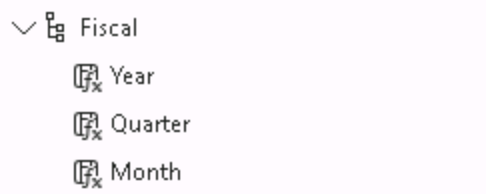 | 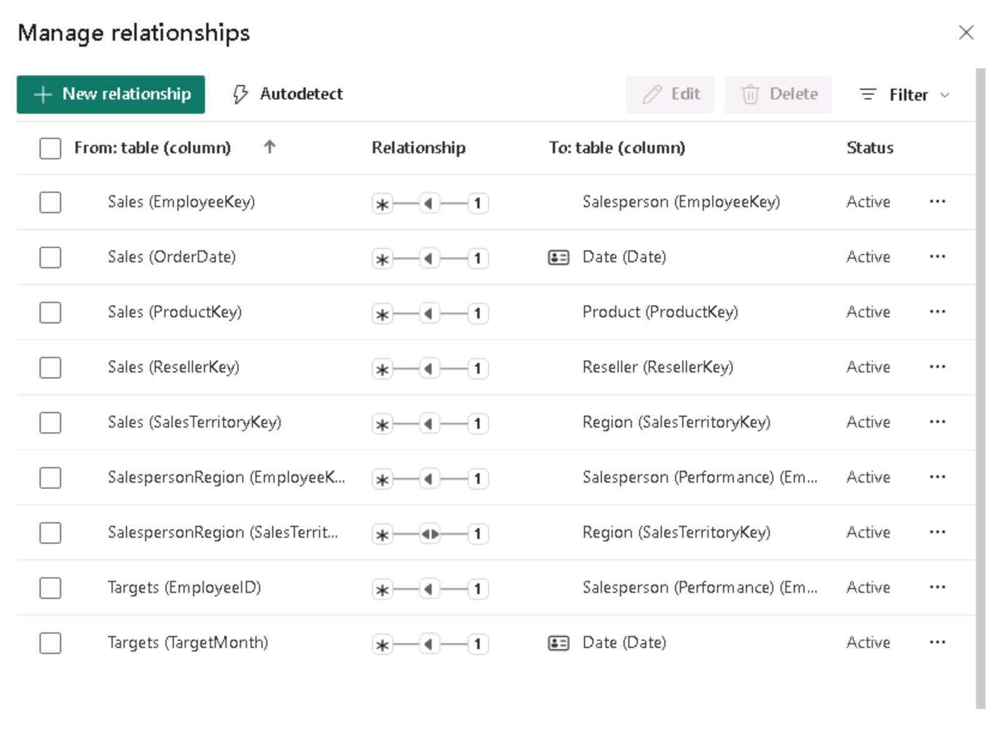 | 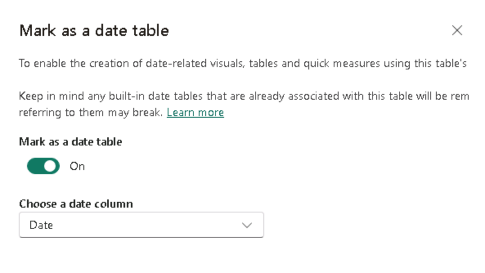 |

### 6. Create simple measures
When I added the `Unit Price` **column** to a visual, Power BI let me switch its aggregation to Sum, Count and so on. That can easily produce wrong reports, for example by summing prices. A **measure** fixes the aggregation in its formula:

```dax
Avg Price    = AVERAGE(Sales[Unit Price])
Median Price = MEDIAN(Sales[Unit Price])
Min Price    = MIN(Sales[Unit Price])
Max Price    = MAX(Sales[Unit Price])
Orders       = DISTINCTCOUNT(Sales[SalesOrderNumber])   -- each order counted once
Order Lines  = COUNTROWS(Sales)                         -- each row is one order line
```

I then organized the new measures:

- The price measures got 2 decimal places and went into a **Pricing** display folder.
- `Orders` and `Order Lines` got a thousands separator and went into a **Counts** folder.
- I hid the `Unit Price` column, so report authors use the measures instead.

| Column aggregation options | Avg Price vs. Average of Unit Price | Pricing folder |
|---|---|---|
| 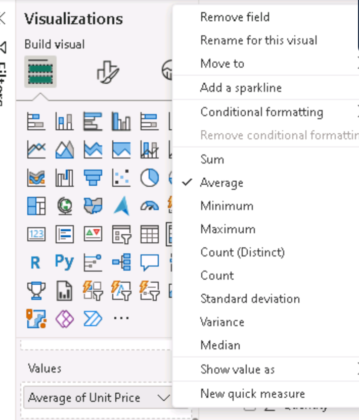 | 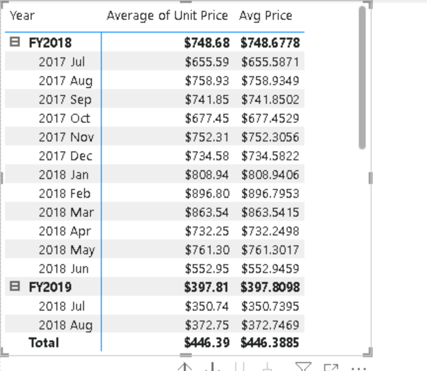 | 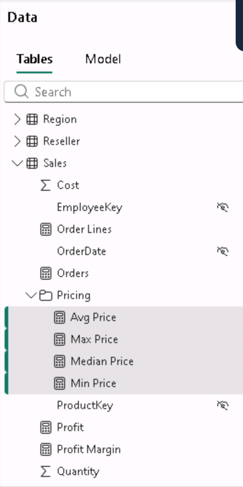 |

Across the whole period:

| Avg price | Median price | Min–Max price | Orders | Order lines |
|---|---|---|---|---|
| 446.39 | 214.24 | 1.33 – 2,146.96 | 3,616 | 57,851 |

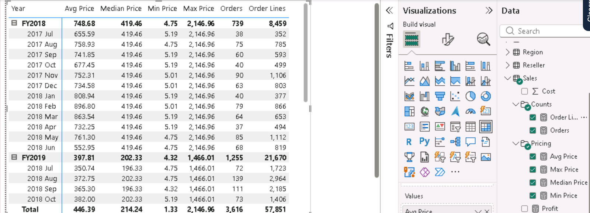

### 7. Create the Target, Variance and Variance Margin measures
The table visual showed a Target total of **$676,210,000**. That number is meaningless, because it just adds up every salesperson's target. I renamed the `Target` column to `TargetAmount`, hid it, and replaced it with a measure that returns a value only when **exactly one salesperson** is in the filter context:

```dax
Target =
IF(
    HASONEVALUE('Salesperson (Performance)'[Salesperson]),
    SUM(Targets[TargetAmount])
)

Variance =
IF(
    HASONEVALUE('Salesperson (Performance)'[Salesperson]),
    SUM(Sales[Sales]) - [Target]
)

Variance Margin = DIVIDE([Variance], [Target])
```

With the new measure, the total row shows **blank** instead of a misleading sum.

Every salesperson showed a negative variance. For example, Brian Welcker was $144,151,430 (−65.02%) below target, and José Saraiva was closest to target among the visible rows at −26.49%. That's because the visual isn't filtered to a time period yet.

| Before: misleading total | After: blank total | Variance and Variance Margin |
|---|---|---|
| 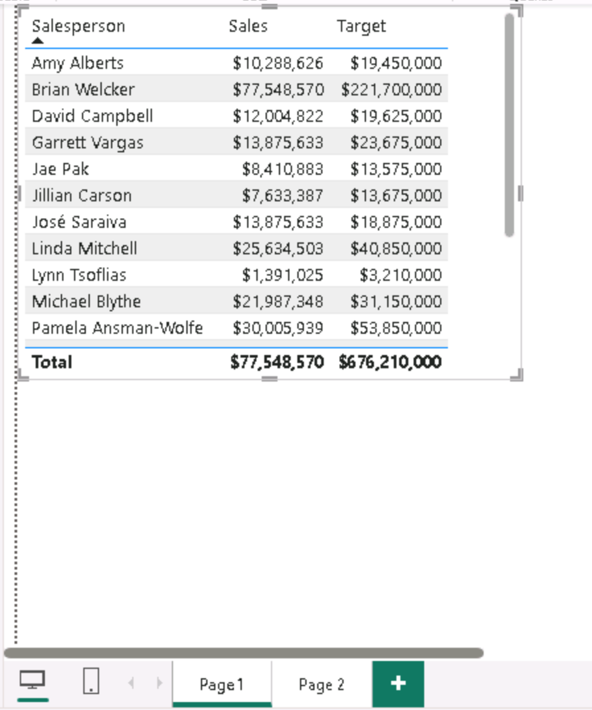 | 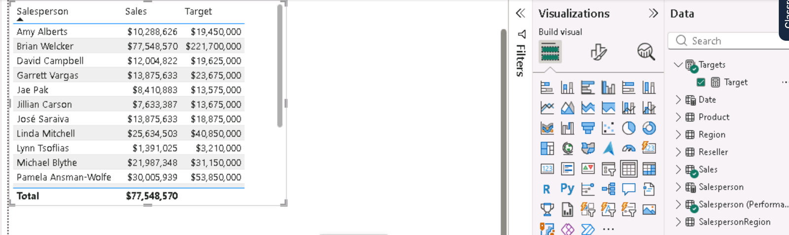 | 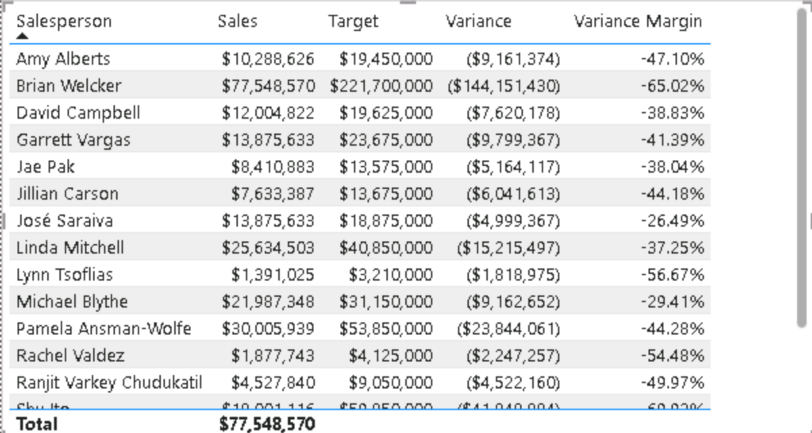 |

## Reflection

This lab showed me how much of a report's business logic can live in the **semantic model** instead of in individual visuals. DAX has three main kinds of calculation:

- **Calculated tables** and **calculated columns** are computed row by row and stored in the model, which increases its size.
- **Measures** are calculated at query time, based on the current filter context.

Building the **Date table** was the most practical part for me. Because the fiscal year ends in June, I had to think about how calendar months map to fiscal periods; for example, July 2017 is FY2018 Q1. The sorting problem was a good lesson: text columns always sort alphabetically, so a hidden numeric `MonthKey` with **Sort by column** is needed. The Fiscal hierarchy and **Mark as date table** made the model ready for drill-down and time intelligence.

The simple measures showed me why good data modelers **hide numeric columns like `Unit Price`** and expose measures instead. A measure fixes the aggregation, and display folders and formatting make the model easier to use. I also saw the difference between `Orders` (distinct order numbers) and `Order Lines` (rows): 3,616 orders contain 57,851 lines.

The most interesting part was `HASONEVALUE()`. The $676,210,000 target total looked like a real number but was just a sum of targets that should never be added together. I also noticed that the **Sales** total in the same visual was $77,548,570, which is exactly Brian Welcker's sales, not the sum of the rows. That happens because `Salesperson (Performance)` filters sales through each person's assigned regions, and several people share regions. Totals in a model with region-based relationships must be read carefully, and a **blank total is better than a wrong one**.

I now see the semantic model as the place where calculations are defined once and reused in every report.
